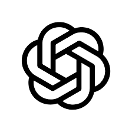
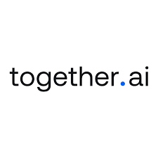

<p align="center">
  
</p>

<h1 align="center">🎙️ TapWisper Desktop</h1>

<p align="center">
  <strong>Open-source, system-wide voice dictation with AI.</strong><br/>
  Bring Your Own API key. Download, configure, and start using it in seconds.
</p>

<p align="center">
  <a href="https://tapwisper.ai">🌐 tapwisper.ai</a>
</p>

<p align="center">
  <a href="LICENSE"></a>
  
  <a href="https://www.electronjs.org/"></a>
  <a href="https://react.dev/"></a>
  <a href="https://github.com/sponsors/zeyadelosherey"></a>
</p>

<p align="center">
  &nbsp;&nbsp;
  &nbsp;&nbsp;
  &nbsp;&nbsp;
  &nbsp;&nbsp;
  
</p>

<p align="center">
  <em>Supports Google Gemini · OpenAI · Claude · Together AI · Soniox</em>
</p>

---

## 📥 Download

<p align="center">
  <a href="https://github.com/zeyadelosherey/tapwisper-desktop/releases/latest">
    
  </a>
</p>

| Platform | Download | Architecture |
|:--------:|:--------:|:------------:|
| 🍎 macOS | <a href="https://github.com/zeyadelosherey/tapwisper-desktop/releases/download/v1.1.0/tapwisper-desktop-1.1.0-arm64.dmg"></a> | Apple Silicon (M1/M2/M3/M4) |
| 🍎 macOS | <a href="https://github.com/zeyadelosherey/tapwisper-desktop/releases/download/v1.1.0/tapwisper-desktop-1.1.0-x64.dmg"></a> | Intel |
| 🪟 Windows | <a href="https://github.com/zeyadelosherey/tapwisper-desktop/releases/download/v1.1.0/tapwisper-desktop-1.1.0-setup.exe"></a> | x64 |

<p align="center">
  📦 Browse all versions on the <a href="https://github.com/zeyadelosherey/tapwisper-desktop/releases">Releases page</a>
</p>

---

## 🚀 Quick Start

1. **📥 Download** the installer for your platform from the table above
2. **⚙️ Open** the app and go to **Settings → AI Provider**
3. **🔑 Paste** your API key (Gemini, OpenAI, Claude, or Together AI)
4. **🎤 Start using it** — press <kbd>Option</kbd>+<kbd>Space</kbd> (Mac) or <kbd>Alt</kbd>+<kbd>Space</kbd> (Win/Linux) to record

> 💡 No account needed. No sign-up. Just your API key and you're ready to go.

---

## 🌍 Works Everywhere You Type

TapWisper runs system-wide — just speak and your text appears in **any app** on your computer. No plugins, no integrations, no setup per app.

| Category | Apps |
|:--------:|------|
| 💻 **Code Editors** | Cursor, Windsurf, VS Code, Xcode, JetBrains (IntelliJ, WebStorm, PyCharm), Neovim, Terminal |
| 💬 **Communication** | Slack, Discord, Microsoft Teams, Gmail, Outlook, Telegram, WhatsApp, iMessage |
| 📝 **Productivity** | Notion, Obsidian, Google Docs, Microsoft Word, Linear, Jira, Confluence |
| 🌐 **Browsers** | Chrome, Safari, Firefox, Arc, Edge, Brave — any website, any text field |
| 🤖 **AI & Dev Tools** | ChatGPT, Claude, Cursor Chat, GitHub, GitLab, any CLI or REPL |

...and literally **every other app** on macOS, Windows, and Linux. If you can type in it, TapWisper works in it.

> ⌨️ Press **Option+Space** (Mac) or **Alt+Space** (Windows/Linux), speak, and your words appear wherever your cursor is. It's that simple.

---

## 💡 Why TapWisper?

TapWisper is a **free, open-source** alternative to tools like [WhisperFlow](https://whisperflow.com) and [SuperWhisper](https://superwhisper.com). Unlike closed-source alternatives, TapWisper gives you full control:

| | Feature | Description |
|:-:|---------|-------------|
| 🔑 | **BYOAPI** | Bring Your Own API key — no subscriptions, no middleman |
| 🔓 | **100% Open Source** | Inspect, modify, and contribute. MIT licensed |
| 🛡️ | **Privacy First** | Audio & text go directly to your chosen provider. Nothing passes through our servers |
| 🖥️ | **Cross-Platform** | macOS, Windows, and Linux |

---

## ✨ Features

| | Feature | Description |
|:-:|---------|-------------|
| 🎤 | **Voice Dictation** | Push-to-talk or toggle recording from anywhere on your system |
| 🤖 | **AI Text Transformations** | Rewrite, summarize, translate, fix grammar, and more |
| 🔌 | **Multiple AI Providers** | Google Gemini, Together AI, OpenAI, Claude |
| 🗣️ | **Multiple Voice Providers** | Together Whisper, Soniox |
| ⚡ | **Custom Actions** | Create your own AI action categories and prompts |
| 🎯 | **Voice Triggers** | Hands-free automation with fuzzy-matched voice commands |
| 📋 | **Text Snippets** | Quick text expansion via trigger phrases |
| 📝 | **Voice Notes** | Record and transcribe notes |
| 🛒 | **Prompt Marketplace** | Browse and install community prompt templates |
| 🌐 | **Multi-Language** | English, Arabic, German, Spanish, French, Italian |
| 🌙 | **Dark Mode** | System, dark, and light theme support |
| ↔️ | **RTL Support** | Full right-to-left layout for Arabic |

---

## ⌨️ Keyboard Shortcuts

| Shortcut | Action |
|:--------:|--------|
| <kbd>Option</kbd>+<kbd>Space</kbd> (Mac) / <kbd>Alt</kbd>+<kbd>Space</kbd> (Win/Linux) | Hold to record (push-to-talk), tap to toggle |
| <kbd>Option</kbd>+<kbd>Space</kbd>+<kbd>Space</kbd> | Open pinned recording panel |
| <kbd>Esc</kbd> | Dismiss any panel |

---

## 🛠️ Getting Started (Development)

### 📋 Prerequisites

- [Node.js](https://nodejs.org/) v18 or later
- npm v9 or later
- macOS 12+, Windows 10+, or Linux

### 📦 Installation

```bash
# Clone the repository
git clone https://github.com/zeyadelosherey/tapwisper-desktop.git
cd tapwisper-desktop

# Install dependencies
npm install

# Run in development mode
npm run dev
```

### 🏗️ Build & Package

```bash
# Build for production
npm run build

# Package for your platform
npm run dist:mac     # macOS (DMG + ZIP)
npm run dist:win     # Windows (NSIS installer)
npm run dist:linux   # Linux (AppImage)
```

### 📜 Available Scripts

| Script | Description |
|--------|-------------|
| `npm run dev` | 🔄 Start the app in development mode with hot reload |
| `npm run build` | 📦 Build for production |
| `npm run dist` | 🚀 Build and package for distribution |
| `npm run typecheck` | ✅ Run TypeScript type checking |
| `npm run lint` | 🔍 Run ESLint |
| `npm run format` | 💅 Format code with Prettier |

---

## 🧰 Tech Stack

| Technology | Purpose |
|:----------:|---------|
| ⚛️ **React 19** | UI framework |
| ⚡ **Electron 33+** | Cross-platform desktop shell |
| 🎨 **Tailwind CSS** | Utility-first styling |
| 🏎️ **Vite** | Fast dev builds via electron-vite |
| 🔐 **electron-store** | Encrypted config storage |
| 🗄️ **better-sqlite3** | Activity database |
| 🐻 **Zustand** | State management |
| 🌍 **i18next** | 6-language localization |
| 🎬 **Framer Motion** | Smooth animations |

---

## 🤖 AI Providers

| Provider | Type | Description |
|:--------:|:----:|-------------|
|  **Google Gemini** | LLM | Fast, versatile language model |
|  **Together AI** | LLM + Voice | Language model and Whisper transcription |
|  **OpenAI** | LLM | GPT models for text processing |
|  **Claude** | LLM | Anthropic's Claude models |
|  **Soniox** | Voice | High-accuracy speech-to-text |

---

## 📁 Project Structure

```
src/
  main/            # ⚙️ Electron main process (tray, shortcuts, windows, IPC)
  preload/         # 🔒 Context bridge (secure API for renderer)
  renderer/        # 🎨 React frontend
    components/    #   🧩 Overlay UI (recording pill, pinned panel, command popup)
    pages/         #   📄 Settings window pages (home, settings, triggers, etc.)
    services/      #   🔌 AI API clients (Gemini, OpenAI, Claude, Together, Soniox)
    hooks/         #   🪝 React hooks (audio, shortcuts)
    store/         #   🗂️ Zustand state stores (stats, activity)
    models/        #   📐 TypeScript type definitions
    constants/     #   📌 Shared constants (colors, providers)
    utils/         #   🔧 Shared utility functions (formatting)
    i18n/          #   🌐 Translation files (en, ar, it, es, fr, de)
    assets/        #   🖼️ Static assets (logos, images)
    styles/        #   🎨 Global CSS and theme
    types/         #   📝 Global type declarations
```

---

## 🤖 AI Agent Guidelines

This project includes configuration files for AI coding assistants so they can understand the codebase:

| Tool | Config File | Description |
|:----:|-------------|-------------|
| [Cursor](https://cursor.com) | [`.cursor/rules/`](.cursor/rules/) | Project rules for Cursor AI |
|  [Claude Code](https://docs.anthropic.com/en/docs/claude-code) | [`CLAUDE.md`](CLAUDE.md) | Project context for Claude Code CLI |
|  [OpenAI Codex](https://openai.com/codex) | [`CODEX.md`](CODEX.md) | Project context for OpenAI Codex |
|  [GitHub Copilot](https://github.com/features/copilot) | [`.github/copilot-instructions.md`](.github/copilot-instructions.md) | Project context for Copilot |

---

## ❤️ Sponsor TapWisper

TapWisper is free and open source. If you find it useful, please consider supporting its development:

### 🙏 Individual Supporters

You can sponsor the project through GitHub Sponsors — every contribution helps keep the project maintained and growing:

<p align="center">
  <a href="https://github.com/sponsors/zeyadelosherey">
    
  </a>
</p>

### 🏢 Corporate Sponsorship

If your company uses TapWisper and would like to sponsor the project, partner on features, or discuss enterprise support, we'd love to hear from you:

- 📧 **Email**: [support@tapwisper.ai](mailto:support@tapwisper.ai)
- 💬 **GitHub Discussions**: [Start a conversation](https://github.com/zeyadelosherey/tapwisper-desktop/discussions)

> Corporate sponsors get visibility on this README and priority feature discussions.

---

## 🆘 Support

Have a question, found a bug, or want to request a feature?

- 📧 **Email**: [support@tapwisper.ai](mailto:support@tapwisper.ai)
- 🐛 **Issues**: [GitHub Issues](https://github.com/zeyadelosherey/tapwisper-desktop/issues)

## 🤝 Contributing

We welcome contributions! TapWisper is open source and community-driven. Please read our [Contributing Guide](CONTRIBUTING.md) to get started.

## 🔒 Security

For reporting security vulnerabilities, please see our [Security Policy](SECURITY.md).

## 📄 License

This project is licensed under the **MIT License** — see the [LICENSE](LICENSE) file for details.

## 🙌 Acknowledgements

Built with ❤️ using [Electron](https://www.electronjs.org/), [React](https://react.dev/), [Tailwind CSS](https://tailwindcss.com/), [Vite](https://vite.dev/), and many other great open-source projects.
